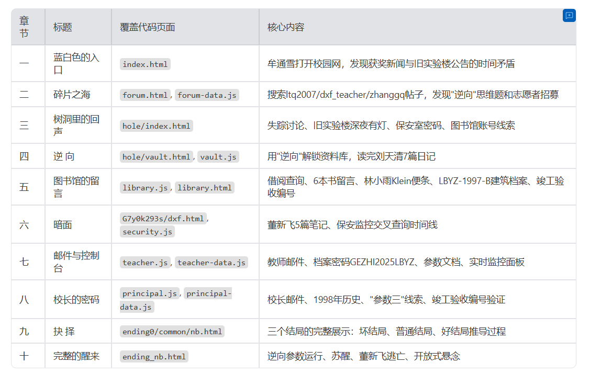

——

一、蓝白色的入口

十一月二十五日，星期二。距离刘天清发出那条消息已经过去了整整五天。

牟通雪盯着手机屏幕上那个再普通不过的链接——lbyz.edu.cn/campus——看了整整三分钟，才终于点了下去。

屏幕加载了不到两秒钟。一个蓝白色调的校园网站铺展在她眼前：顶部是狼堡市第一中学的校徽和导航栏，首页轮播图循环滚动，公告栏里写着"踔厉奋发冬仨月，力学不倦铸辉煌"。

一切看起来都太正常了。正常到让人怀疑刘天清是不是发错了链接。

但轮播图切换到第二张时，牟通雪的手指停住了。

"11月20日 · 我校刘天清同学荣获全市数学联赛一等奖 · 全校庆贺。"

十一月二十号。他得奖那天晚上给她发的消息。然后，他就消失了。

学校把他的获奖新闻挂在首页轮播图上，好像什么都没有发生过。好像这个得了一等奖的男孩此刻还坐在教室里，而不是在某个无人知晓的地方沉默着。

牟通雪继续往下看。校园新闻列表里，一条标注"重要"的红色通知赫然在列：

"旧实验楼整修公告：10月10日起暂停使用，禁止学生进入。"

紧接着它上面，是一条发布于十月二十二日的新闻：

"格致创新教育计划成果展示会圆满举行，合作科研机构代表出席致辞。"

格致计划。旧实验楼。这两个词像两根细线，若有若无地搅在一起。

她按照导航栏一个一个页面地翻看。师资团队里，理化组教师董新飞的名字被排在第一行，简介里写着"竞赛指导"和"项目负责人"。知名校友页面没什么特别的。

然后她点进了校园论坛。

——

二、碎片之海

校园论坛看起来和任何一所高中的校内BBS没有区别——求资料的、出二手书的、问补课时间的、吐槽食堂的——帖子杂乱地堆在一起，被浏览数和回复数排列着。

但牟通雪没有盲目地翻页。她记得刘天清说的话：如果我消失了，去图书馆，找我借过的书。而在那之前，他留了这个网站。

她试着在论坛的搜索框里输入了"ltq2007"——刘天清的校园网ID。

搜索结果像翻开一本加密的日记。

第一条帖子标题是"关于「还原」的一道思维题"。刘天清在深夜十一点写下一个看似简单的问题：一个三维物体被沿某轴做了完整的镜像翻转，所有坐标参数都乘以了−1，要把它完整还原，需要做什么操作？他在回复里说，答案是一个日常的中文词，两个字。

有人猜"反转"，有人猜"反向"，有人猜"逆向"。

"最后那个对了，"他回复。

然后有人说："感觉这题不只是在问数学……"

他回复："你说对了。"

第二条帖子是一份借书分享。他列出了最近从图书馆借的几本书：《社会性动物》《行为分析导论》《逆向思维训练》。在《逆向思维训练》的感想里他写道："里面有一句话我觉得挺有意思，大意是说真正的逆向不是反方向走，而是「把参数反转」。"

牟通雪的瞳孔微微收缩。

她继续翻。他的最后一条帖子写于十一月二十日晚上十点三十三分——那是他给她发消息之前不到两个小时——标题是"图书馆今天怎么没系统维护通知"。内容很短，但异常清晰：他注意到一个人签到进了图书馆，却显示没有从正门签出，但闭馆记录里却有签出时间戳，两条记录时间差了三分钟，地点标注对不上。有人追问是谁的记录，他回复"不方便说"。之后再无回复。

她翻到了论坛里另一个ID——dxf_teacher。那是董新飞。他发的唯一一个帖子是"格致科研项目志愿者招募"，时间是九月二十二日。招募内容写着：无创健康检测，化学成绩较好者优先，地点旧实验楼B1层地下室，全程约3小时，奖励50元超市购物券。

有人问"什么叫基础生理数据"，董新飞回复"心率、皮肤电导、脑电基线等常规指标，无创，完全安全"。有人问"旧实验楼不是说要整修吗"，他回复"B1实验室不受影响"。有人说"旧实验楼晚上感觉怪怪的"，他回复"全程有人陪同，请放心报名"。末尾还加了一个笑脸表情。

报名回复里，有一个ID写着"lxy2009"——林小雨。

牟通雪的手开始微微发抖。

她又搜索了"zhanggq"——那是张国强老师，刘天清的竞赛指导老师。他发了一条竞赛复习整理帖，末尾写道："刘天清同学此前曾和我讨论过一个关于'逆向参数'的数学问题，思路很有意思，等他回来可以一起研究。"有学生问刘天清是不是失踪了。张老师回复："学校说是暂时请假，有消息我会告诉你们。"又有人问他知不知道刘天清在查什么，他回复："他问过我旧实验楼的建筑档案在哪里查，我说不清楚，让他去图书馆问。"

教务处的公告更是滴水不漏："近期部分同学请假情况已按照相关程序处理，请家长和同学们放心，不要在网络平台散播未经证实的信息。"而在论坛帖子列表的最底部，有一条被标记为"【内容已删除】"的帖子，作者正是ltq2007。管理员删掉了它。

论坛的线索到此为止。但在论坛某条公告的回复里，一个叫lw2007的学生提到了另一个地方：树洞。一个匿名发布的校内论坛，学生自己搭建的，地址是hole.lbyz.internal。

——

三、树洞里的回声

树洞的页面是深色调的，黑灰为底，帖子像一张张暗处的纸条浮在屏幕上。匿名发帖，动物头像，每个人只有一个随机的昵称。

牟通雪从最新的帖子开始往下翻。

最顶上一条，"漂流的小鱼"发于今天——十一月二十五日：有没有人发现最近刘天清不见了？评论里有人说他发过加密帖，有人说那个"困惑的麋鹿"就是他。

她的视线被一条标注"🔒加密"的帖子牢牢锁住。

"困惑的麋鹿"，六天前发布，标题是"【密】把参数反转"。帖子写道：我在校园网论坛上发过一道题，一个物体沿某轴做了完整的镜像翻转——要把它完整还原到翻转之前，需要做什么操作？那道题的答案，就是这里的密码。两个字。

帖子底部附了一个链接：hole.lbyz.internal/vault。

但她没有立刻点进去。她知道刘天清的习惯——他从不把最重要的东西放在最显眼的地方。她先把树洞里所有帖子全部看完。

林小雨失踪的帖子出现在十一月十三日。"孤独的鹰"在求助：她10月就突然说回老家了，但她妈妈完全联系不上她。手机打不通，微信不回。评论里有人提到——她10月参加过那个志愿者活动，旧实验楼那边的。

五天前的帖子，"警觉的狼"发出了一个关键线索：旧实验楼深夜有人。昨晚大概11点多，他从宿舍看到地下室窗子透出白色日光灯的光。评论里有人说9月初就有了，禁止进入的通知反而是10月才发的。

"好奇的刺猬"吐槽董老师状态不对——上课心不在焉，经常看手机，提前下课。"安静的羊驼"在评论里点破：好像在搞什么格致计划，跟校长一起的。

但真正让牟通雪屏住呼吸的，是两条不起眼的旧帖。

第一条，"沉默的乌龟"发于十一月十日，标题是"第一次进保安室的体验"。说他去借备用饭卡，拍了一张保安室内景。照片里桌角贴着一张黄色便利贴，上面写着：账号security_li，密码101028。

第二条，"夜行的猫头鹰"发于十月十五日，标题是"我妈的图书馆账号被我看到了"。他妈在学校图书馆当管理员，叫刘芳。密码他没有直说，但在另一条帖子的评论里透露了规律：去师资页面找图书馆负责人，看她的职务名称，职务拼音小写加123就是密码。

牟通雪回到校园官网的师资团队页面，找到了图书馆管理员刘芳的信息。她的职务是"馆员"。

guanyuan123。

她把这个密码和lib_admin的用户名记在心里，然后打开了树洞的加密链接。

——

四、逆 向

vault页面漆黑一片，中央悬浮着一个锁的图标和一行字："刘天清的资料库。你已经找到这里了。答案就在他留下的谜里。"

密码框在等待输入。

牟通雪的脑海里回荡着论坛上那道思维题的答案，回荡着《逆向思维训练》书评里那句话——"把参数反转"。

她在密码框里输入了两个字：逆向。

锁消失了。

七篇日记像从水底浮上来的七枚信号弹，依次亮起。

十月十八日。他和她去南门外的书店，在沙县吃了碗饭，路过旧实验楼时习惯性地往地下室方向看了一眼。她问他看什么，他说没什么。"我没有告诉她林小雨的事。她不需要知道。至少现在不行。"

十月二十八日。董建延——董新飞的儿子——在图书馆找到他，告诉他父亲最近反常：深夜才回家，说是在搞格致计划收尾。董建延偷看过父亲书房的文件夹，上面有"志愿者"和"采集"的字样，名单最上面是——林小雨。

十一月十日。他确认了格致计划不是健康检测。那些仪器是专业脑电采集设备。林小雨参加志愿者活动后"回老家了"。地下室锁着，但能听到机器的低频声。"如果有一天我也消失了——去图书馆。找我借过的书。"

十一月十二日。他再次去旧实验楼外面。仪器运转的声音，低沉的，持续的。"不要问任何人，也不要相信学校的说法。"

十一月十五日。他进入了地下室。林小雨确实在里面，身上连着电极，旁边仪器运转着。他看到了一个输入参数的窗口。"也许输入一个合适参数就能救出林小雨，但也有可能会害了她。"

十一月十八日。他再次从董建延口中获得情报。北境那边有个人专门负责对接，只在项目开启时来过学校——林小雨失踪的那天。

十一月二十日，晚上十点五十一分。最后一篇。

"今天得奖了，数学联赛一等奖。我把这个链接发给了通雪。"

"通雪，如果你在看这个，说明我没有出来。"

"有一个能在线上填入参数的账号，我没有找到，但是我相信你可以。"

"从书开始找。我借过的那几本书。"

"不要相信学校说的任何话。"

日记的底部，系统备注冷冰冰地标注着：账号ltq2007当前状态——在线（异常），已超过5天未正常登出。

牟通雪把嘴唇咬出了血痕。从书开始找。

——

五、图书馆的留言

她用lib_admin和guanyuan123登录了图书馆管理系统。

系统界面分为三个板块：读者借阅查询、书籍状态查询、馆藏档案检索。

她先查了刘天清的名字。系统返回七条借阅记录：《密码学基础》《都市传说研究》《异常心理学》《建筑结构安全》《逆向思维训练》《高中数学竞赛指南》《监控系统原理》。全部显示"已还"。

然后她切换到书籍查询，一本一本地搜。

《都市传说研究》——刘天清的留言："第三章「封闭建筑的地下结构」——学校的老楼通常比档案记录的更深。"

《异常心理学》——留言："记忆干预章节。人在深度诱导状态下，思维数据是可以被外部设备读取的。这不是科幻。"

《建筑结构安全》——留言极长，像是写给将来会看到的人的便条："旧实验楼1998年档案记录上只有地面层的功能，但图纸显示地下B层结构完整保留。图书馆有没有1997年之前的校园建筑档案？"附注里馆员告知旧图纸存于馆藏档案袋，编号LBYZ-1997-B，可在馆藏档案栏目检索。

《逆向思维训练》——留言只有一句："「把参数反转」——逆向。这个词，记住。"

《监控系统原理》——留言看似随意，实则精准："咱们学校现在的监控探头全是上个世纪的老古董，特别是旧实验楼那边，全损画质而且还有死角，有跟没有一样。"

《密码学基础》——最后一本，也是信息量最大的一本。留言写道："第四章古典加密与现代通讯有点意思，这两天跑去提取旧实验楼B区配电间待机状态下的加密日志，利用波形分析提取密钥流后进行按位取反操作，发现好像得出了一个挺有意思的参数。"

按位取反。待机状态的参数。取反后得出另一个参数。

牟通雪把这些碎片在脑子里艰难地拼接着。但此刻她还不知道那个参数是什么，也不知道该输入到哪里。

她又查了林小雨的借阅记录。只有一本——《Klein有机化学》。留言里记录着一件诡异的事：这本书夹了张便条没取走，便条上只有一个网址：G7y0k293s/dxf.html。

一个隐藏在校园网目录深处的页面。

最后，她在馆藏档案检索里输入了那个编号：LBYZ-1997-B。

系统返回了一份完整的建筑档案：狼堡市第一中学旧实验楼建筑施工图（地面层+地下层），1997年竣工验收版本。页面上展示了两张数字化平面图——一楼和地下一层的完整布局。

地下层，B203，综合实验室——用最显眼的红色边框标注，路径清晰画出：从楼梯间B进入后，沿走廊向东。

档案基本信息里有一行被加粗标红的数据：竣工验收编号——LB-97-EXP-0312。

她把这个编号存了下来。直觉告诉她，这串字符之后还会用到。

——

六、暗面

G7y0k293s/dxf.html。

页面加载出来的那一刻，牟通雪感觉自己推开了一扇不应该被推开的门。

这是董新飞的私人笔记。深黑色的背景，顶部用小字标注着"dxf-notes · 私人站点 · 非学校系统"，页面最上方是一行橙色的警告："你不应该在这里。这个网址不对任何人公开。"

但林小雨的书里夹着它。也许是董新飞自己疏忽了，也许是命运刻意留下的裂缝。

第一篇，2024年10月29日，标签"起点"。他写儿子董建延化竞又没进省队。两年努力，每天做题到深夜，但就是缺少那种直觉。"陈昱找到我的时候，我听进去了。我知道这件事不干净。但建延已经高一了，时间不多了。"

第二篇，2025年11月2日，标签"进展"。林小雨的第一次实验完成了。他盯着设备运转了三个小时，回家时建延还在做题，手机被他规定放在餐桌的远处。他站在门口看了儿子几秒钟，没说话，进了书房。

第三篇，11月8日，标签"转折"。陈昱的邮件里有一句话他看了三遍："数据归属研究院，这一点不会因任何个人关系而改变。"他从那天起把所有邮件打印存档——包括王明德和陈昱对他说的一切承诺。"我不是蠢。我只是当时太想相信他了。"

第四篇，11月10日，标签"行动"。他把实验室控制系统和家里的电脑做了端口映射，加了一条旁路。任何系统未登记的参数执行都会在他家里触发警报。然后，在篇末，他写下了自己的校园网密码：dxf_teacher，密码Lbyz@dxf2023!。"防止我被他们的人抓走，我要把密码放在这里。你需要看所有的邮件，才能弄清楚发生了什么。"

第五篇，11月21日凌晨零点四十三分，标签"深夜"。

"刘天清进来了。我不知道他怎么找到的，但他进来了，B203，今晚11点多。我们没有别的选择，陈昱让我处置，我……我做了。两个孩子现在都在设备里。"

"建延在睡觉。我站在他房间门口站了很久。"

牟通雪关掉了这个页面。她的手指在发抖，但她的头脑从未如此清醒。

密码拿到了。邮件里一定有更多真相。

但在登录董新飞的账号之前，她先用保安室的密码做了一件事——确认时间线。

她用security_li和101028登录了保安监控系统，开始交叉查询日期和地点。

十月二十八日，旧实验楼。进入人员：董新飞、林小雨、陈昱。时间21:34。备注栏用刺眼的橙色标注："当晚22:10触发异常警报，记录状态：已手动关闭。"

十一月五日、十日、十五日——旧实验楼——全部是董新飞，登记类型"设备维修"，维修方"狼堡精仪科技"。十一月十五日那次还多了一个人：陈昱。

十一月二十日，图书馆。进入人员：刘天清。签到20:05，闭馆签出21:30——但正门摄像头无对应画面。

十一月二十日，旧实验楼。进入人员：董新飞、刘天清。时间23:02。备注："当晚23:18触发异常警报，记录状态：已手动关闭。"

而十月二十九日至十一月二日、十一月二十一至二十二日的所有录像，系统显示"设备处于维护状态，记录不可用"。

精心设计的盲区。林小雨被困的第二天到第五天，刘天清被困的第二天到第三天——所有记录全部消失。

——

七、邮件与控制台

她用dxf_teacher和Lbyz@dxf2023!登录了校园网教师系统。

董新飞的邮箱里存着十多封邮件，时间从九月跨到十一月，发件人分别是"C.Y."（陈昱）和王明德。

最早的邮件是陈昱发给董新飞的设备确认函：设备发货、B203电路改造截止日期、受试者筛选优先认知活跃度高的学生、诱导剂量按体重精确计算。他写道："B203的噪音隔离方案已升级，地面建筑那边基本听不到。"

董新飞回复时问了一个关键问题：如果实验中途受试者产生应急反应怎么处理？陈昱的回复轻描淡写："不会有问题的。这套方案已经在受控环境下验证过，我不方便告诉你是在哪里验证的。"他接着提到了董建延的事——"认知采集完成后，我们确实可以分析高效学习者的思维路径，对有针对性的辅助训练是有参考价值的。等项目推进到一定阶段再谈。"

然后是一封封冷冰冰的工作汇报。董新飞向王明德报告实验进展，措辞克制，语气恭敬。王明德的回复永远简短、决断、不留余地："请做好一切保密工作，无论如何不能让第三方介入。如果有学生或家长询问，统一说是回老家了。"

十一月二十日深夜23:47，董新飞发出的那封紧急邮件最为关键：刘天清今晚强行进入旧实验楼，已紧急处置，该学生已被纳入实验。王明德次日清晨的回复里，顺带给出了一个信息——档案系统的密码，"格致——年份——我们学校的拼音缩写，三段拼在一起就是"。

GEZHI2025LBYZ。

牟通雪随即打开了教师系统的档案栏目，输入了这个密码。

加密文件解锁了。

那是一份名为"格致计划 — 实验参数说明文档 v2.3"的机密文件。它用冷静的技术语言描述了两种已知参数：

参数一：0.0.0.1——默认运行。维持受试者深度诱导状态，持续采集脑波数据。

参数二：168.112.43.255——暂停采集。切换为生命维持模式，但长期使用会导致记忆碎片化。

底下是一行红色警告：严禁强制断开仪器连接或输入无效参数。异常中止将导致不可逆神经损伤甚至死亡。

文件末尾标注了权限说明——实际操作权限归属校长账号wmd_principal，教师账号仅可查看，无法执行参数切换。

她在教师系统的实验室管理界面搜索了"格致"。屏幕上弹出了实时监控面板，绿色的状态指示灯缓慢脉动着：

受试者A / 刘天清——心率68 bpm，脑波θ波偏高，深度诱导状态。
受试者B / 林小雨——心率72 bpm，脑波δ波稳定，深度睡眠状态。
运行时长：35天16小时。数据采集进度：87.3%。

他们还活着。

但面板底部用暗红色标注着："权限不足——实验终止与参数调整操作需由校长账号执行。"

"如有紧急情况，请联系王明德校长（wmd_principal）登录后处理。"

牟通雪需要校长的密码。

——

八、校长的密码

线索其实早就摆在那里了。

王明德在给董新飞的邮件里说得很清楚：档案密码就是"格致——年份——学校拼音缩写，三段拼在一起"。那是GEZHI2025LBYZ。

她在教师系统人员档案里查到了王明德的校长账号wmd_principal。这个密码适用于什么范围，她不确定，但校长和教师的档案系统共享同一套密码逻辑——毕竟是同一个人设定的。

她退出了董新飞的账号，在登录页输入了wmd_principal和GEZHI2025LBYZ。

校长办公系统的界面展开在她面前。

校长的邮件比教师端更加冰冷。陈昱在最早的合作确认邮件里写道："合作模式已详述，有一点需要强调：受试者以「志愿者」名义参与，签署的同意书不涉及「神经采集」等敏感字样。" 然后他提到了董新飞："他有一个关于他儿子的私人诉求，研究院不会正式兑现，数据归属研究院所有。但他有这个期待，对我们推进项目是有利的。请王校长配合，不要主动澄清。"

利用一个父亲对儿子的爱，把他变成工具，然后在项目结束后丢弃。

王明德的回复同样冷酷，他提到了1998年：如果实验过程中出现受试者身体异常，处置方案是什么？那次出了问题之后花了很长时间才平息——旧实验楼B203，二十七年前就被用于类似实验。1998年因"事故"停用，如今重新激活。

最关键的邮件来自陈昱，发于十一月二十三日："刘天清的数学思维数据采集质量远超预期……林小雨的数据理论上已采集完毕，但刘天清还需要2-3周。"他在末尾提醒："有且只有一种不留痕迹的唤醒方式。届时请使用实验室控制台的参数三。强制断开或输入无效参数会造成不可逆损伤。"

参数三。文档里没有记载的第三个参数。

但邮件里也没有给出参数三的具体数值。

校长版的加密档案比教师版多了一些内容——参数说明更完整，措辞更直白。末尾的操作指南写道："前往「实验室管理」→ 搜索「格致」→ 输入旧实验楼竣工验收编号 → 点击「调整参数」→ 输入参数 → 确认执行。"

竣工验收编号。图书馆档案里那串她已经记住的字符——LB-97-EXP-0312。

她打开了校长系统的实验室管理界面，搜索"格致"。同样的实时监控面板弹出，两个人的心跳像两簇微弱的烛火在数字里跳动。

面板下方出现了一个验证区域："操作高危设备前，系统须核查实验设施合规状态。请输入实验设施所在建筑的竣工验收编号以解锁控制权限。"

她输入了LB-97-EXP-0312。

验证通过。

控制台解锁了。两个按钮出现在屏幕上：

⏹ 结束实验

⚙ 调整参数

——

九、抉 择

牟通雪坐在那块发光的屏幕前，面前是两个按钮和一个空白的参数输入框。从她收到那条微信消息开始，到此刻，她一个人走过了整座迷宫——从论坛帖子到树洞留言，从图书馆借阅记录到建筑档案图纸，从董新飞的私人笔记到校长的机密邮件——最终，所有线索指向了同一个终点。

"结束实验"——强制断开仪器连接。档案上用红色加粗写着"后果不可预测"，陈昱的邮件里说过，强制断开会造成不可逆神经损伤甚至死亡。在B203的地下室里，两个人的大脑还连接着那些冰冷的电极。如果她按下这个按钮，第二天清晨她走进地下室时看到的，将是两具安静的身体和归零的心率监测器。

她不能按这个。

那么，"调整参数"。

她知道两个参数。参数一，0.0.0.1，是当前正在运行的默认采集模式。输入它毫无意义。参数二，168.112.43.255，待机模式。它能暂停采集，保住两人的命——但档案上写得清清楚楚：超过48小时将导致受试者醒来后出现记忆碎片化，部分近期记忆模糊或丢失。

如果她输入待机参数，刘天清和林小雨都能活下来。仪器会平稳地进入待机，不触发任何异常信号——包括董新飞家里那条旁路警报。她可以报警，警察在天亮前赶到。两人获救。董新飞和王明德被带走调查。

但刘天清醒来后，可能会永远忘记某些东西。也许是一段记忆，也许是一个名字。

也许是她的名字。

但还有第三种可能。

她的脑子里反复回旋着刘天清在图书馆留言里写下的那些碎片："把参数反转——逆向""待机状态下的加密日志，按位取反操作，发现好像得出了一个挺有意思的参数"。论坛上那道思维题的答案——逆向。Vault日记里他说他看到了参数窗口，在研究怎么救林小雨。他说他还没有把握。

但他把线索留下来了。不是留给自己的，是留给她的。

待机参数是168.112.43.255。每个字节对应一个0到255之间的数。取反——用255减去每一个数——

255 – 168 = 87
255 – 112 = 143
255 – 43 = 212
255 – 255 = 0

87.143.212.0。

这就是参数三。这就是陈昱在邮件中提到的"唯一一种不留痕迹的唤醒方式"。这个数字不存在于任何档案文档里，不存在于校长的加密手册里，不存在于陈昱留给王明德的任何一封邮件的正文里。

它是刘天清自己推导出来的。

一个十七岁的男孩，在发现同学被囚禁在地下室的设备上之后，在他自己也即将被吞噬的最后几个小时里，走遍了图书馆，翻遍了他能找到的每一本书，从密码学和神经工程的交叉地带推导出了这个数字。他来不及把它直接写出来。但他把推导的方法，以碎片的形式，藏在了每一条借书留言、每一条论坛帖子、每一篇加密日记里。

他把最后一丝火种，交给了他最信任的人。

牟通雪在参数输入框里，一个数字一个数字地敲下了：

87.143.212.0

系统弹出确认框："即将启动逆向参数87.143.212.0。系统将把采集到的全部数据完整写回受试者大脑。此过程约需15—30分钟，完成后受试者自然苏醒。"

她按下了确认。

——

十、完整的醒来

逆向参数开始运行。

在那栋被爬山虎覆盖的旧实验楼地下B203室里，两台仪器的指示灯从冷白色缓缓变为了温暖的琥珀色。数据流的方向第一次反转了——不再是从大脑中抽取，而是向大脑中写回。那些被残忍剥离的思维模式、记忆片段、灵光乍现的解题直觉，一帧一帧地回到了它们本该属于的地方。

θ波逐渐回落。δ波恢复正常起伏。

刘天清和林小雨在警察赶到之前就已经睁开了眼睛。

他们记得一切。

但在那个参数被写入系统的同一瞬间，大约十分钟路程之外的一栋老居民楼里，董新飞家中的电脑发出了警报。

那是他自己埋下的旁路——一条把B203控制台接回家中的线。逆向参数不是系统预设的合法参数，它的执行触发了旁路上的异常信号监测。

屏幕上跳出的不是正常的待机通知，而是一条从未出现过的警告。

董新飞没有多想。他站起来，从书房的柜子里拿出一个不大的背包，把硬盘装进去——那块硬盘里存着从八月到现在每一封邮件的备份，是他给自己留的最后的筹码——走出了家门。

他经过了建延的房间。门虚掩着，里面传出均匀的呼吸声。

他站了两秒钟。然后他转过身，轻轻带上了门。

王明德校长在天亮后被警方逮捕。旧实验楼B203被封锁。北境神经工程研究院的格致计划在狼堡市第一中学的实验基地被彻底曝光。

但董新飞消失了。

他的校园网账号再也没有上线。他家中那台埋着旁路的电脑被警方搜走时，硬盘槽是空的。

当你再次尝试用他的教师账号登录实验室系统时——

屏幕上只剩下一行字：

"⚠️ 警告：实验参数异常，设备自检失败。远程连接已断开。"

光标在句末静静地闪烁着。

他去了哪里？带走了什么？

也许，这不是最后一个学校……

所有内容均为虚构，与任何真实人物、团体或事件无直接关系。

